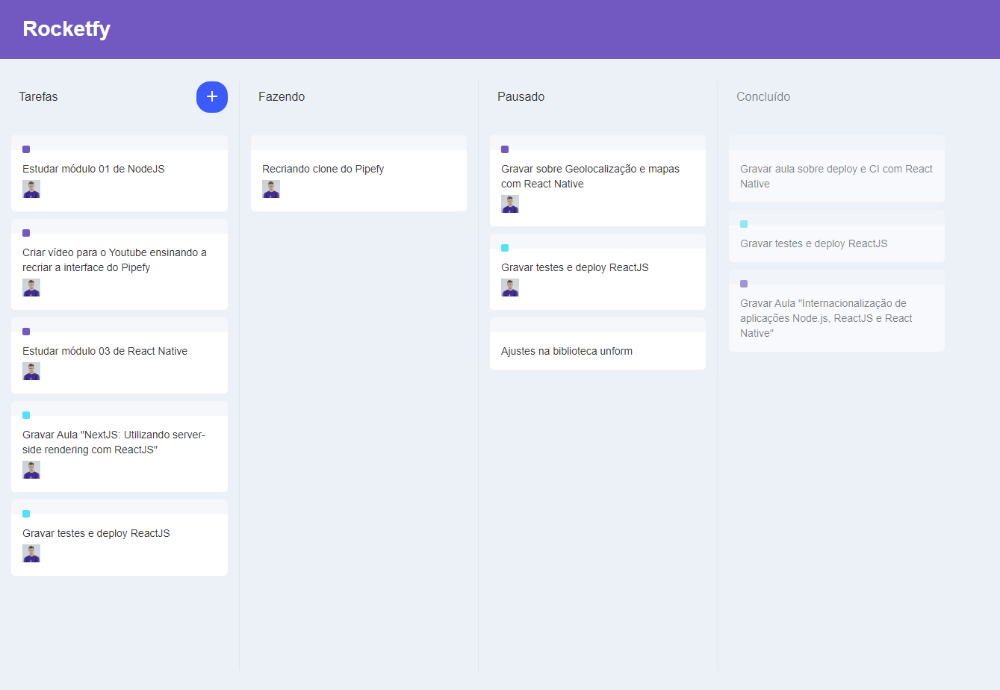

# Rocketfy



## Descrição

Rocketfy é um clone básico do Trello desenvolvido em ReactJS com funcionalidade de drag and drop. O projeto foi inspirado no Trello e foi criado com o objetivo de aprender e praticar essa funcionalidade.

## Funcionalidades Principais

- Interface minimalista e intuitiva
- Arraste e solte para organizar as notas
- Adicione, edite e exclua notas facilmente

## Instalação

1. Clone o repositório:

   ```
   git clone https://github.com/npcwalison/rocketfy.git
   ```

2. Instale as dependências:

   ```
   cd rocketfy
   npm install
   ```

3. Inicie o servidor de desenvolvimento:

   ```
   npm start
   ```

4. Abra o navegador e acesse `http://localhost:3000`.

## Tecnologias Utilizadas

- ReactJS
- HTML5
- CSS3

## Como Contribuir

Sinta-se à vontade para enviar pull requests e propor melhorias. Ficarei feliz em analisá-las!

## Licença

Este projeto está licenciado sob a [MIT License](LICENSE).
